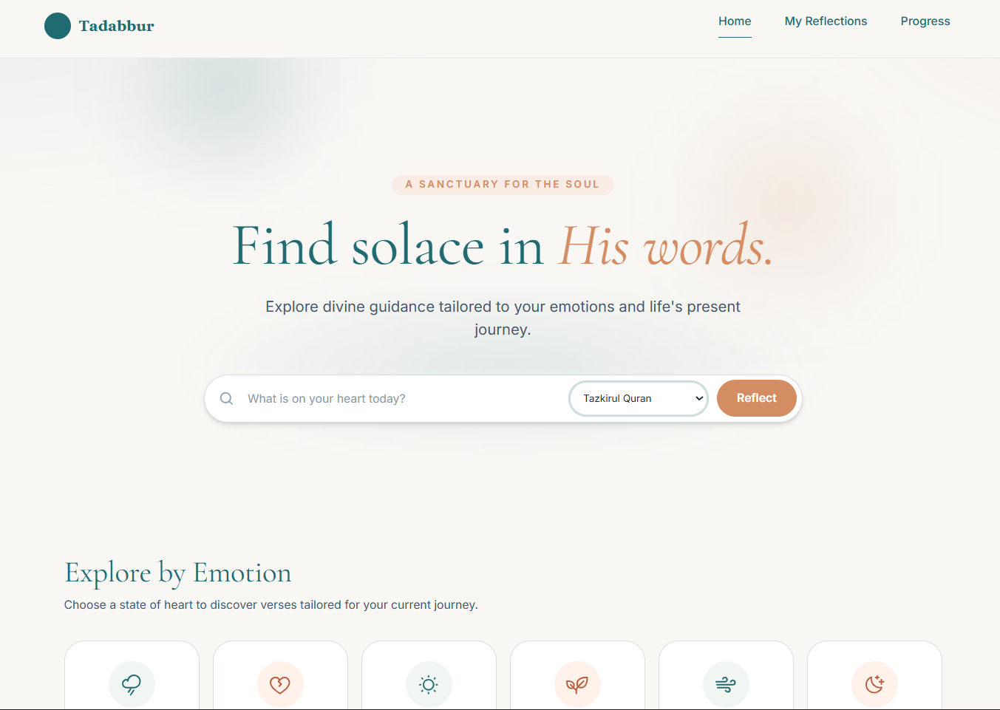

# Inshirah: Quran Reflection App

[](https://nextjs.org/)
[](https://reactjs.org/)
[](https://tailwindcss.com/)
[](LICENSE)
[Live Link](https://tadabbur-reflect.vercel.app/)

A modern, interactive web application that empowers Muslims to deepen their connection with the Quran through guided reflection, personalized insights, and progress tracking.

## 🌟 Problem Statement

In today's fast-paced world, many Muslims struggle to maintain consistent Quran study and reflection. Traditional methods lack personalization, progress tracking, and interactive features that make spiritual growth engaging and sustainable.
## Screenshot



## 🚀 Solution

Inshirah provides a seamless platform for Quran reflection with:
- **Guided Verse Selection**: Intuitive interface for browsing and selecting verses
- **Rich Reflection Editor**: Live markdown preview for thoughtful journaling
- **Personalized Insights**: AI-powered emotion-based verse recommendations
- **Progress Tracking**: Visual dashboards to monitor spiritual growth
- **Tafseer Integration**: Multiple scholarly sources for deeper understanding

## ✨ Key Features

### 📖 Interactive Quran Browser
- Browse surahs and verses with clean, responsive design
- Audio recitation integration for immersive experience
- Multiple tafseer sources for comprehensive understanding

### ✍️ Rich Reflection Editor
- Live markdown preview while writing
- Tag system for organizing reflections by themes
- Timestamped entries for tracking spiritual journey

### 🎯 Personalized Recommendations
- Emotion-based verse search using natural language processing
- Smart suggestions based on reflection history
- Thematic exploration through reflection tags

### 📊 Progress Analytics
- Visual progress tracking across surahs and verses
- Achievement system for milestones
- Statistics dashboard for reflection patterns
- **Quran Foundation User API Integration**: Streak tracking with future sync capabilities (demo placeholder)

### 🔐 Secure Authentication
- OAuth integration with Quran Foundation API (partially implemented)
- Secure user sessions and data privacy
- Cross-device synchronization (planned)

## 🛠️ Tech Stack

- **Frontend**: Next.js 15, React 19, Tailwind CSS 4
- **Backend**: Next.js API Routes
- **Database**: Local storage with future MongoDB integration
- **Authentication**: Quran Foundation OAuth (scaffolding in place)
- **AI/NLP**: OpenRouter API for emotion-based verse recommendations, Compromise.js for local NLP processing
- **Quran APIs**: Quran Foundation Content API (for search/verses), User API (streak tracking - demo integration)
- **UI Components**: Custom components with Phosphor Icons
- **Markdown**: React Markdown with remark-breaks

## 📋 Prerequisites

- Node.js >= 20.9.0
- npm, yarn, pnpm, or bun

## 🚀 Installation

1. **Clone the repository**
   ```bash
   git clone https://github.com/your-username/inshirah-quran-reflect-app.git
   cd inshirah-quran-reflect-app
   ```

2. **Install dependencies**
   ```bash
   npm install
   # or
   yarn install
   # or
   pnpm install
   ```

3. **Set up environment variables**
   ```bash
   cp .env.example .env.local
   ```
   Configure your Quran Foundation API credentials and other settings.

4. **Run the development server**
   ```bash
   npm run dev
   # or
   yarn dev
   # or
   pnpm dev
   ```

5. **Open your browser**
   Navigate to [http://localhost:3000](http://localhost:3000)

## 📖 Usage

### Getting Started
1. **Sign In**: Authenticate with your Quran Foundation account (future implementation)
2. **Browse Verses**: Explore the Quran using the interactive browser
3. **Select a Verse**: Choose a verse that resonates with you
4. **Write Reflection**: Use the rich editor to journal your thoughts
5. **Track Progress**: View your spiritual journey on the progress dashboard, with Quran Foundation User API integration for streaks (demo placeholder)

### Advanced Features
- **Emotion Search**: "Find verses about patience" or "verses for hope" (powered by OpenRouter AI)
- **Tafseer Comparison**: Compare multiple scholarly interpretations
- **Tag Organization**: Categorize reflections by themes like "patience", "gratitude"
- **Audio Recitation**: Listen while reflecting for deeper immersion
- **User API Integration**: Streak tracking via Quran Foundation User API (future full sync)

## 🏗️ Project Structure

```
tadabbur-app/
├── app/                    # Next.js App Router
│   ├── api/               # API routes
│   ├── globals.css        # Global styles
│   ├── layout.js          # Root layout
│   └── page.js            # Homepage
├── components/            # Reusable UI components
├── lib/                   # Utility functions and API clients
├── public/                # Static assets
└── scripts/               # Build and maintenance scripts
```

## 🤝 Contributing

We welcome contributions! Please follow these steps:

1. Fork the repository
2. Create a feature branch (`git checkout -b feature/amazing-feature`)
3. Commit your changes (`git commit -m 'Add amazing feature'`)
4. Push to the branch (`git push origin feature/amazing-feature`)
5. Open a Pull Request

### Development Guidelines
- Follow ESLint configuration
- Write meaningful commit messages
- Test your changes thoroughly
- Update documentation as needed

## 📄 License

This project is licensed under the MIT License - see the [LICENSE](LICENSE) file for details.

## 🙏 Acknowledgments

- Quran Foundation for Content API access, authentication scaffolding, and User API integration (streak tracking demo)
- Islamic scholars for tafseer sources
- OpenRouter for AI-powered emotion search
- Open source community for amazing tools and libraries

## 📞 Contact

For questions or support, please open an issue on GitHub.

---

*Built with ❤️ for the Muslim community to foster deeper connections with the Quran.*
